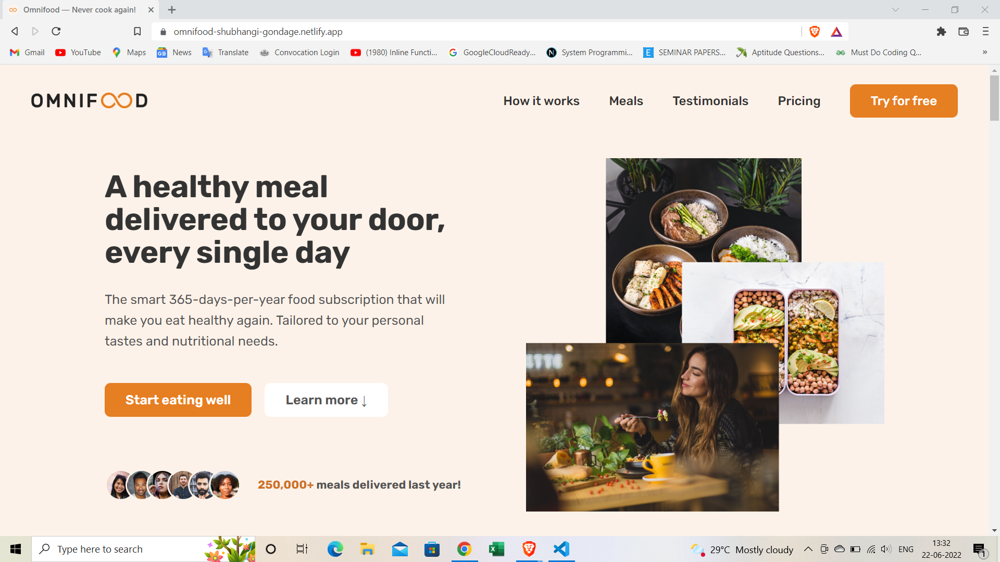
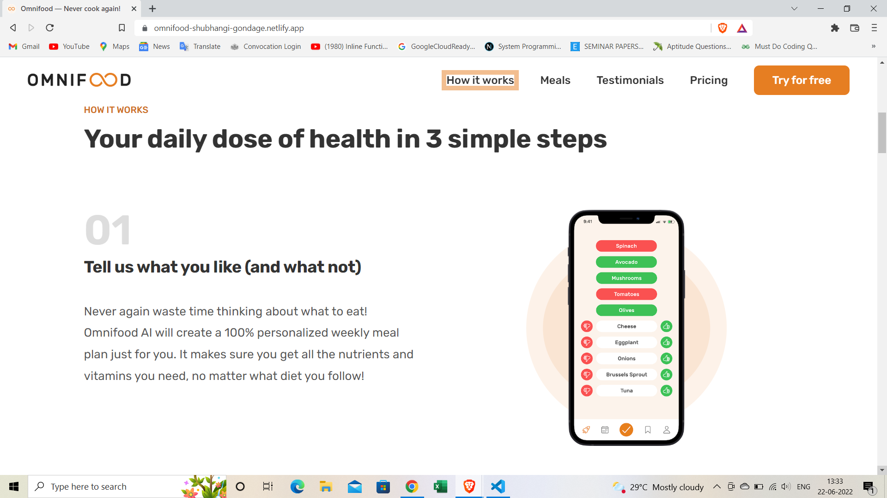
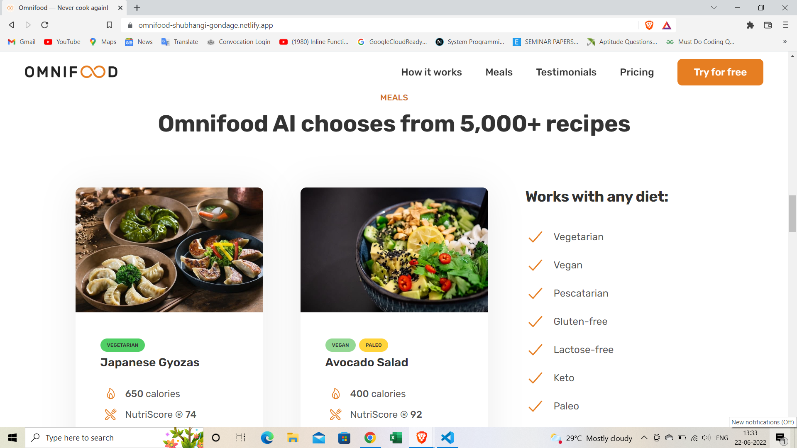
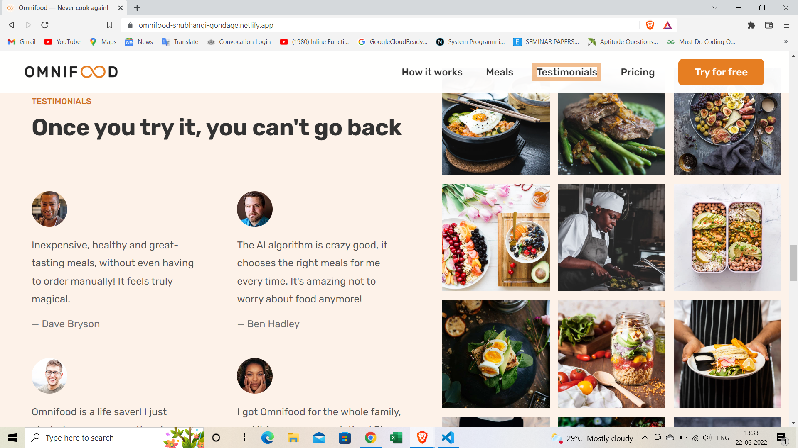
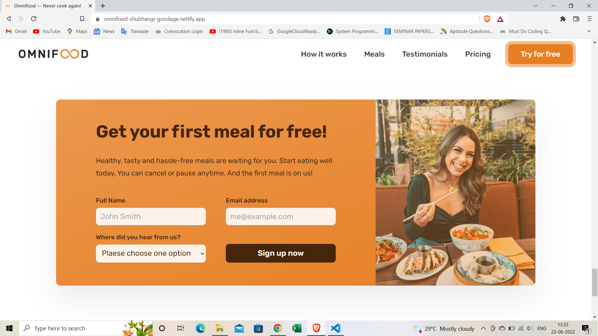

# Omnifood
This website is the clone of the Omnifood website
<a href="https://omnifood-shubhangi-gondage.netlify.app/">Omnifood.com</a>

Home Page 

How it works

Meals

Testimonials

Contact

Features 📋
⚡️ Fully Responsive
⚡️ Valid HTML5 & CSS3
⚡️ Fully Responsive
⚡️ User Friendly
